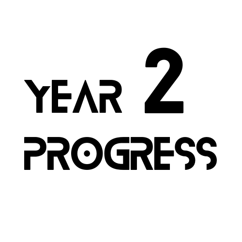
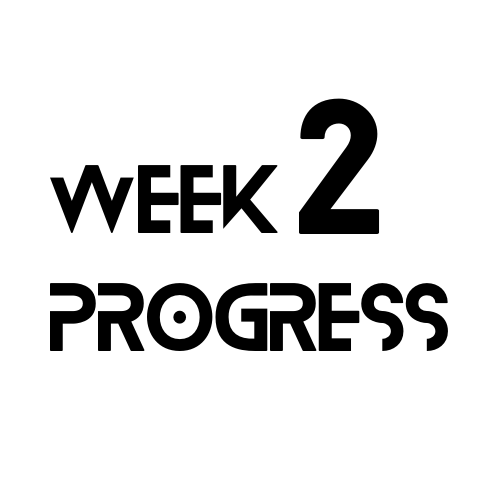

<h2 align="center">
    
    <b>+</b>
    
     
    Year Progress 2
    <b>+</b>
    Week Progress 2
     
</h2>

<h4 align="center">An open source alternative of <a href="https://twitter.com/year_progress" alt="twitter.com/year_progress">Year Progress</a> and <a href="https://twitter.com/weekprogress" alt="twitter.com/year_progress">Week Progress</a>
</h4>

[![License][1]][2] [![Github Repo Size][3]][4] [![Github Contributors][5]][6] [![Github Last Commit][7]][8]

  <a href="#contributing">Contributing</a> •
  <a href="#join-us-in-discussions">Discussion</a> •
  <a href="#maintainers">Maintainers</a>

## Contributing

If you want to contribute to this project, please read the [CONTRIBUTING.md](CONTRIBUTING.md) file.

<table>
  <tr>
    <td>
    
    <h3>Thanks for contributing :purple_heart:</h3>
    <ul>
      <li>Thanks for all your contributions and efforts</li>
      <li>We thank you being part of our :sparkles: commUnity :sparkles: !</li>
    </ul>
    
    </td>
  </tr>
</table>

## Join us in discussions

We use GitHub Discussions to talk about all sorts of topics related to documentation and this project. For example: if you'd like help troubleshooting a PR, have a great new idea, or want to share something amazing, join us in the [discussions][11].

## Maintainers

This project is maintained by the following team members:

- [@harshraj8843](https://github.com/harshraj8843)

---

Made with 💖 by Codinasion

---

[1]: https://img.shields.io/github/license/codinasion/year-progress-2
[2]: https://github.com/codinasion/year-progress-2/blob/master/LICENSE.md "License"
[3]: https://img.shields.io/github/repo-size/codinasion/year-progress-2 "Repo Size"
[4]: https://github.com/codinasion/year-progress-2
[5]: https://img.shields.io/github/contributors/codinasion/year-progress-2 "Contributors"
[6]: https://github.com/codinasion/year-progress-2/graphs/contributors
[7]: https://img.shields.io/github/last-commit/codinasion/year-progress-2 "Last Commit"
[8]: https://github.com/codinasion/year-progress-2/graphs/commit-activity
[11]: https://github.com/orgs/codinasion/discussions "Discussions"
